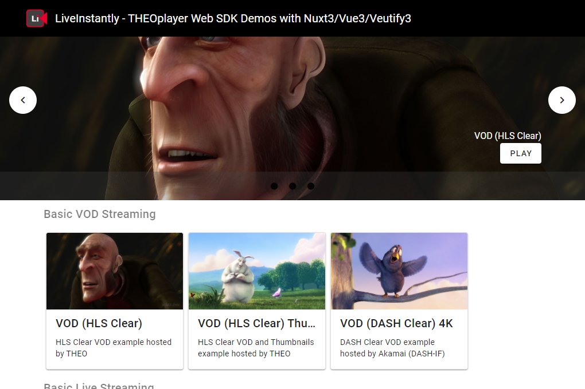

# THEOplayer Web Demo App with Nuxt 3

[Demo App](https://theoplayer.demo.liveinstantly.cloud/)

This repository introduces our THEOplayer player demo web application as a practical application integrated with THEOplayer Web SDK for your video services.

THEOplayer is the universal video player solution created by THEO Technologies. The THEOplayer offers player SDKs for multiple platforms (such as HTML5 (Web), Apple iOS, Apple tvOS, Google Android, Google Android TV, Samsumg Tizen, LG webOS, Amazon FireTV, ROKU) which support for HLS, MPEG-DASH, advertisements, DRM and much more.

This demo web app is integrated with Nuxt 3, Vue 3, and Vuetify 3 frameworks to play multiple video stream examples with THEOplayer Web SDK.



This demo web app is deployed onto Netlify. Please access the demo site: [https://theoplayer.demo.liveinstantly.cloud/](https://theoplayer.demo.liveinstantly.cloud/).

As of now, we demonstrates THEOplayer Web SDK only with a couple of example video streams, but we will add more examples soon to demonstrate much more features and scenarios with THEOplayer Web SDK.

## How to use this web app

This repository has started with with Nuxt 3 Minimal Starter template to implement this web app.

For more details of Nuxt 3, please look at the [nuxt 3 documentation](https://v3.nuxtjs.org) to learn more.

### Setup

Make sure to install the dependencies:

```bash
# yarn
yarn install

# npm
npm install

# pnpm
pnpm install --shamefully-hoist
```

### Development Server

Start the development server on <http://localhost:3000>

```bash
# yarn
yarn dev

# npm
npm run dev
```

### Build for Production

Build the application for production:

```bash
# yarn
yarn build

# npm
npm run build
```

Locally preview production build:

```bash
# yarn
yarn preview

# npm
npm run preview
```

### Use your own THEOplayer codes

This web app uses our managed THEOplayer Web SDK component issued by THEO. You will need to change the links of THEOplayer Web SDK to refer your managed THEOplayer Web SDK component.

Also, you will need to use your own license code for THEOplayer Web SDK component. For your local test, you can create .env file at the root folder of this repository to add your own license code to it so that THEOplayer Web SDK component can get the license code for working content playback.

```shell
NUXT_PUBLIC_THEOPLAYER_LICENSE="<license code BASE64 string>"
```

### Deploy onto Netlify

This repository provides netlify.toml configuration file for deploying this web application onto Netlify hosting services.

For your THEOplayer license, you can set **NUXT_PUBLIC_THEOPLAYER_LICENSE** environement variables in your Netlify site.

### Additional notes

Some notes are here:

* This web app uses Vuetify 3 for material design components.
